# Belajar Fundamental Aplikasi Flutter

**Download file demo android : *git_asset/demo.apk***

|   **Submission 1**  |   **Submission 2**  | **Submission 3** |
|:-------------------:|:-------------------:|:----------------:|
| Branch Submission 1 | Branch Submission 2 |    Branch Main   |

# Sertifikat

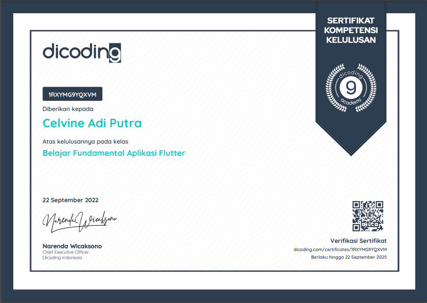

# Kriteria

## Fitur yang harus ada pada aplikasi

1. Favorite Restaurant
    - Pengguna harus bisa menambah dan menghapus restoran dari daftar favorit.
    - Aplikasi harus mempunyai halaman untuk menampilkan daftar favorit.
    - Menampilkan halaman detail dari daftar favorit.
2. Daily Reminder
    - Terdapat pengaturan untuk menghidupkan dan mematikan reminder di halaman setting.
    - Daily reminder untuk menampilkan restoran secara acak pada pukul 11.00 AM.
3. Testing
    - Menuliskan minimal satu skenario pengujian untuk memverifikasi proses parsing json telah berhasil.

# Screenshot

    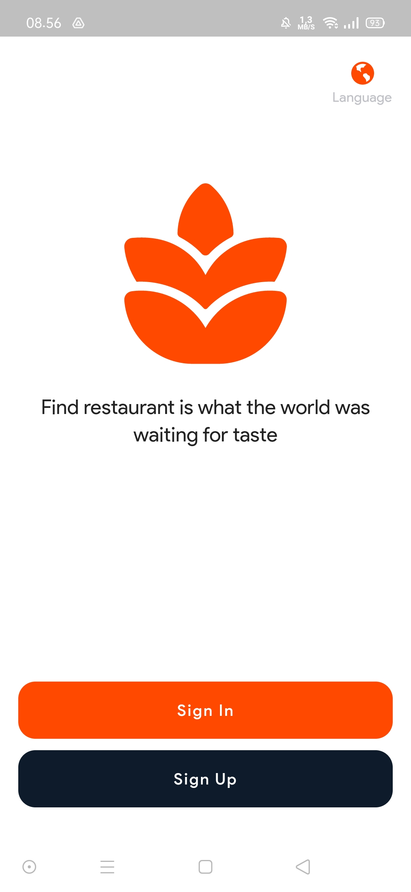
    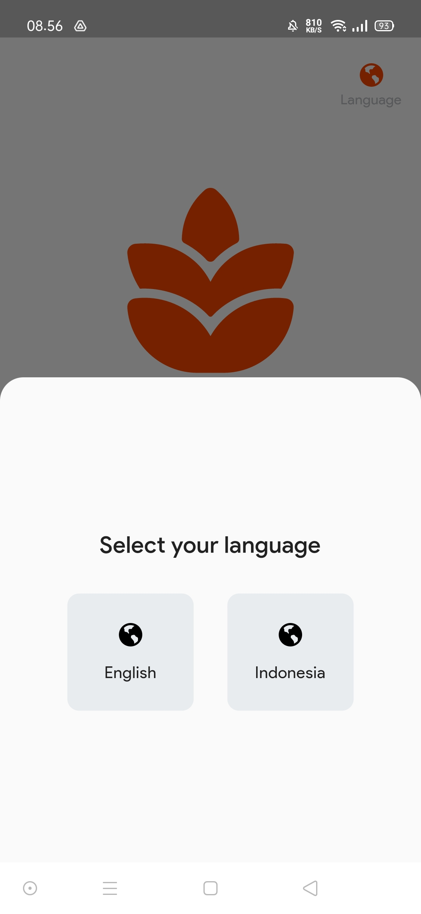
    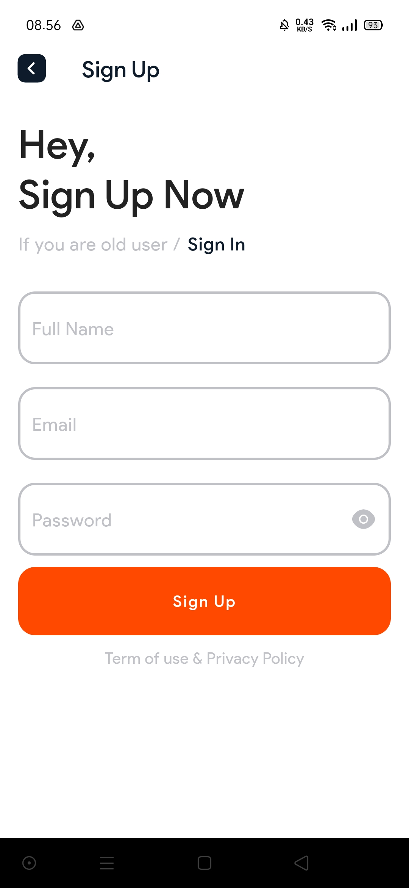
    
    
    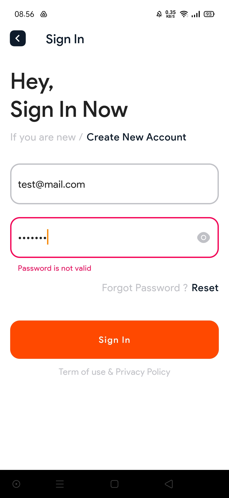
    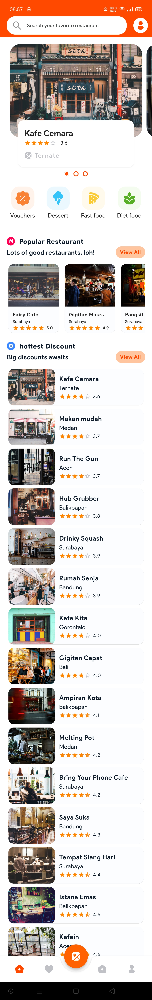
    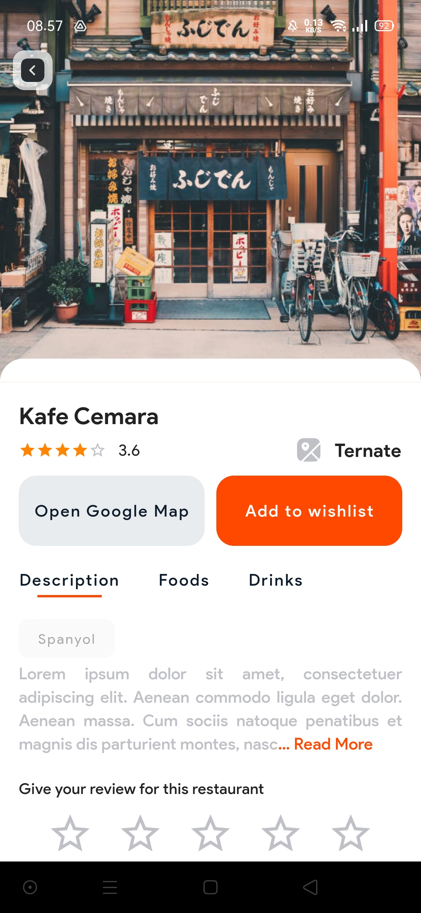
    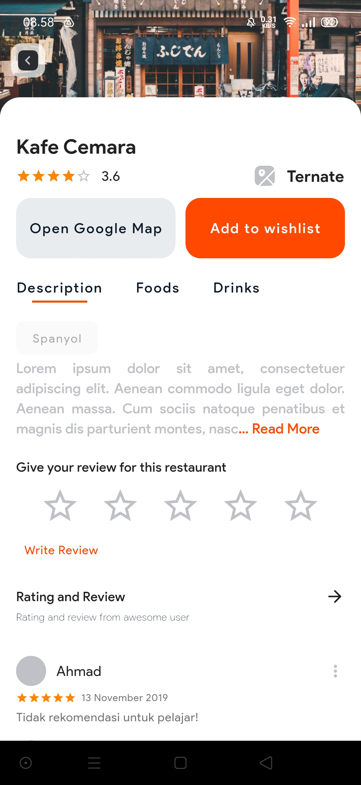
    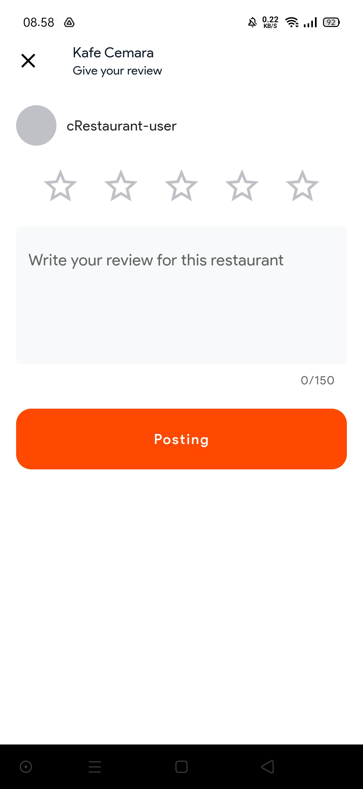
    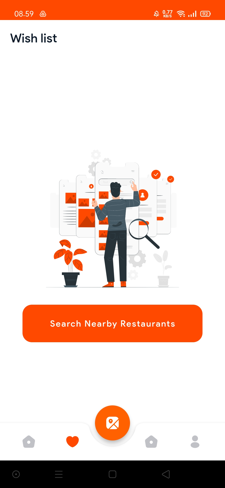
    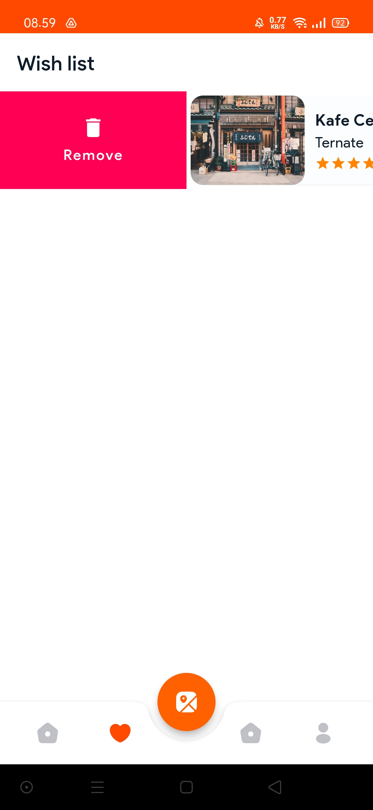
    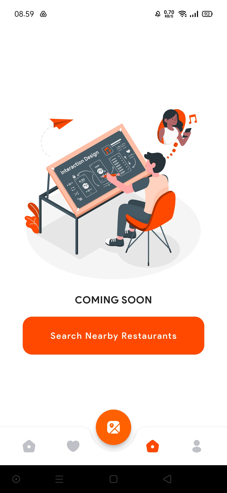
    
    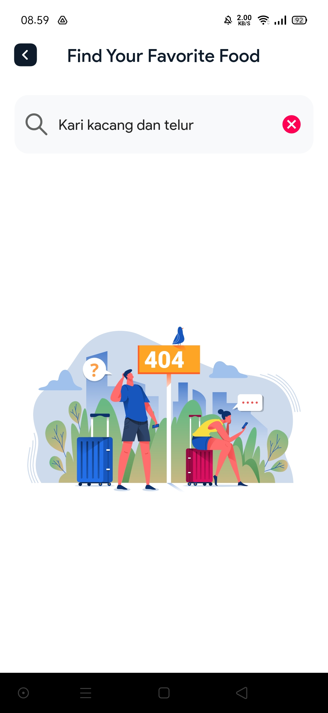
    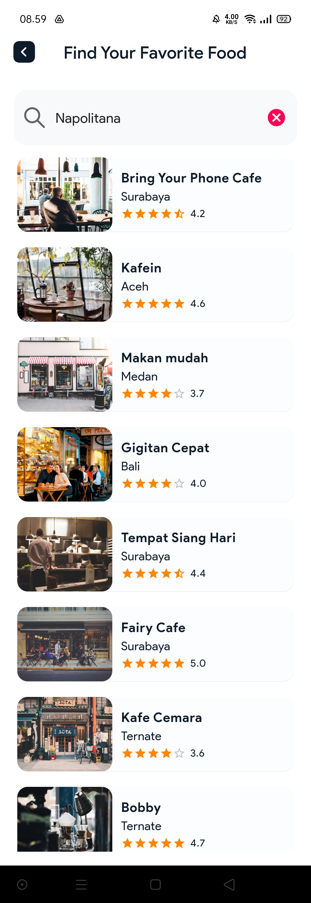
    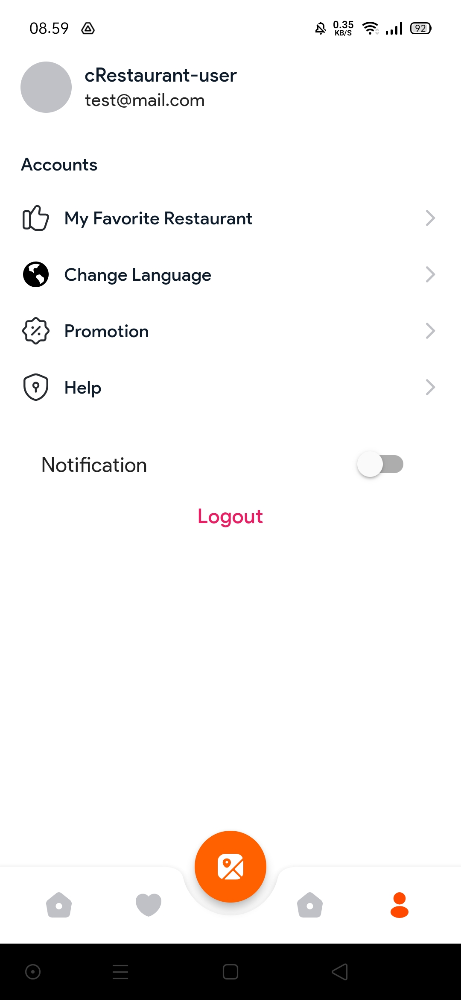

